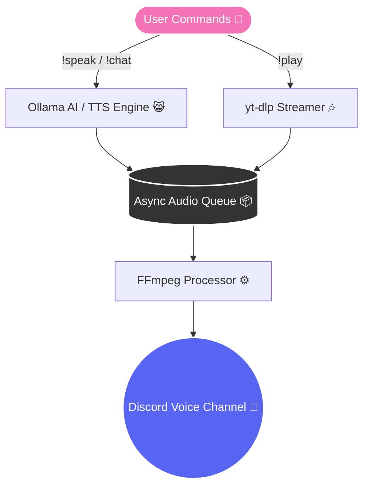

<div align="center">


<!-- Cute Typing SVG Header -->


<p align="center">
  <b>A smart, ultra-cute Discord bot combining AI Chat, Thai Text-to-Speech, and Music Streaming! 🐾✨</b>
</p>

<!-- Cute Tech Stack Badges -->
<p align="center">
  
  
  
  
  
</p>

</div>

---

## 🌸 Core Features 🐾

<table width="100%" style="border-collapse: collapse;">
  <tr>
    <td width="50%" align="center">
      <h3>🗣️ Advanced Thai TTS</h3>
      <p>High-fidelity Thai text-to-speech using Microsoft Edge Neural voices. Switch between male and female voices on the fly! 😸</p>
    </td>
    <td width="50%" align="center">
      <h3>🤖 Local AI Integration</h3>
      <p>Talk to Ollama LLMs directly in your voice channel. The bot processes your questions and reads the answers out loud! ✨</p>
    </td>
  </tr>
  <tr>
    <td width="50%" align="center">
      <h3>🎵 Music Streaming</h3>
      <p>Built-in <code>yt-dlp</code> integration for high-quality YouTube audio. Supports precise start times and durations for perfect playback! 🎶</p>
    </td>
    <td width="50%" align="center">
      <h3>📋 Intelligent Audio Queue</h3>
      <p>A unified async queue system that flawlessly handles the transition between AI speech and music streams without overlapping! 🐾</p>
    </td>
  </tr>
</table>

---

## 🚀 Quick Setup 🧶

### Prerequisites
1. **Python 3.10+** 🐍
2. **FFmpeg** (`brew install ffmpeg`) 🎬
3. **Ollama** (`brew install ollama` and `ollama pull llama3.2`) 🧠

### Installation

```bash
git clone https://github.com/E27-25/thai-tts-bot.git
cd thai-tts-bot

python3 -m venv venv
source venv/bin/activate
pip install -r requirements.txt

cp .env.example .env
# Edit .env and add your DISCORD_TOKEN 🔑
```

### Execution
```bash
python bot.py
```

---

## 🎀 Command Reference 🐈

<div align="center">

| Command | Arguments | Description |
|:---|:---|:---|
| 🐾 `!speak` / `!s` | `<text>` | Converts Thai text to neural speech in the current voice channel. |
| 🐾 `!chat` / `!c` | `<query>` | Queries Ollama and reads the response aloud. |
| 🐾 `!play` / `!p` | `<url>` `[start]` `[duration]` | Streams YouTube audio. (e.g., `!play เพลงแมว 01:30 30`) |
| 🐾 `!skip` | | Skips the currently playing audio stream. |
| 🐾 `!queue` / `!q` | | Displays the current pending audio queue. |
| 🐾 `!voice` / `!v` | `[voice_name]` | Changes the active TTS voice. Leave blank to view options. |
| 🐾 `!stop` | | Immediately halts playback and clears the entire queue. |
| 🐾 `!join` / `!leave` | | Manually control the bot's voice channel presence. |

</div>

---

## 🏗️ Architecture 🧶



<br/>
<div align="center">
  
  <p><i>Engineered for performance, built with love. 💖🐾</i></p>
</div>
